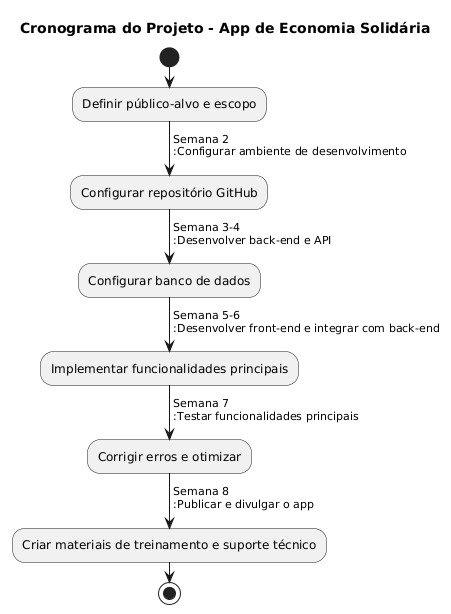
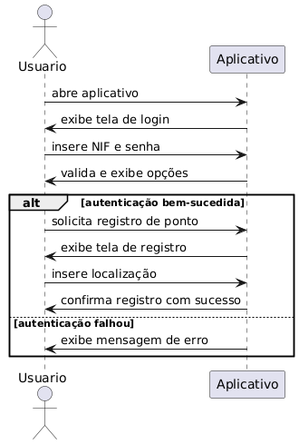
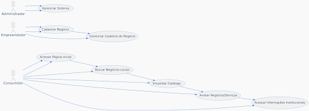
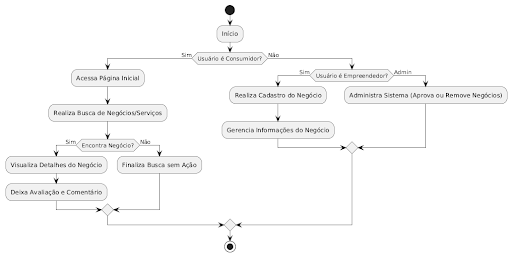

# App de Economia Solidária

## Descrição Geral
O app será uma plataforma de conexão entre pequenos negócios e consumidores locais. Ele visa oferecer visibilidade, acesso fácil a produtos/serviços e um canal direto para negociação, enquanto incentiva o consumo local e a economia solidária.

## Etapas do Desenvolvimento

### 1. Identificação do Problema
**Problema**: Pequenos negócios têm dificuldade em se destacar online, alcançar consumidores locais e gerenciar seus produtos/serviços digitalmente.  
**Impacto**: Baixa visibilidade afeta a sustentabilidade desses negócios e reduz o consumo local.  
**Solução**: Criar uma plataforma que centralize produtos/serviços de negócios locais, facilite o pagamento e promova a confiança entre consumidores e empreendedores.

### 2. Planejamento e Definição de Requisitos

#### Funcionalidades principais do app:
- **Página Inicial (Home)**: Apresenta negócios e promoções em destaque. Inclui campo de busca por categoria, nome ou localização.
- **Catálogo de Produtos/Serviços**: Permite filtrar por localização, categorias e faixa de preços. Oferece páginas detalhadas para cada produto/serviço, com descrição e avaliações.
- **Cadastro de Negócios**: Formulário para registrar informações do negócio, como descrição, localização e horário de funcionamento. Opção de upload de fotos e painel para gerenciar anúncios.
- **Perfil do Negócio**: Página personalizada com informações do negócio. Exibição de produtos/serviços cadastrados. Mapa interativo mostrando a localização.
- **Sistema de Avaliação**: Avaliações por estrelas e comentários dos clientes. Filtros para visualizar avaliações.
- **Página Institucional (Sobre)**: Explica o conceito de economia solidária e os benefícios da plataforma.
- **Notícias e Dicas**: Histórias de sucesso de empreendedores locais. Publicação de dicas de gestão e marketing para pequenos negócios.
- **Contato**: Formulário para dúvidas ou sugestões. Links para redes sociais do projeto.

### Requisitos Funcionais
- **Cadastro de Negócios**: Permitir que empreendedores criem perfis com informações como descrição, localização e horário de funcionamento. Upload de imagens para personalizar o perfil.
- **Busca e Filtros**: Buscar negócios por nome, categoria ou localização. Filtrar por faixa de preço, distância ou avaliação.
- **Sistema de Avaliação**: Permitir que clientes avaliem produtos, serviços ou negócios com estrelas e comentários. Exibir avaliações em perfis e páginas de produtos.
- **Exibição de Destaques**: Mostrar promoções e negócios em destaque na página inicial.
- **Geolocalização**: Exibir um mapa interativo para localizar negócios.
- **Histórias e Dicas**: Publicar histórias de sucesso e dicas úteis para empreendedores.
- **Sistema de Contato**: Formulário para dúvidas ou sugestões. Links para redes sociais integrados no perfil da plataforma.

### Requisitos Não Funcionais
- **Desempenho**: O sistema deve carregar páginas com até 3 segundos em conexões padrão. Suportar pelo menos 500 acessos simultâneos sem degradação de desempenho.
- **Segurança**: Proteger dados de usuários e negócios com autenticação segura. Usar HTTPS para todas as comunicações.
- **Escalabilidade**: Permitir a adição de novas funcionalidades sem alterar o funcionamento atual.
- **Disponibilidade**: Garantir 99,9% de uptime na hospedagem do sistema.
- **Compatibilidade**: Ser acessível em navegadores modernos e dispositivos móveis via React Native.
- **Manutenibilidade**: O código deve seguir padrões claros e ser facilmente compreendido por novos desenvolvedores.
- **Localização**: Suporte para exibir conteúdo baseado na localização do usuário.

## Escopo do Projeto

### Objetivo Geral
Desenvolver uma plataforma digital que conecte pequenos negócios e serviços locais da cidade de Limeira com consumidores, promovendo a economia solidária e incentivando o crescimento de microempreendedores.

### Objetivos Específicos
- **Proporcionar Visibilidade**: Criar um espaço onde pequenos negócios possam divulgar seus produtos e serviços.
- **Facilitar Conexões**: Permitir que consumidores encontrem facilmente negócios locais com base em localização, categorias ou promoções.
- **Promover a Confiança**: Implementar um sistema de avaliações e comentários para dar credibilidade aos negócios.
- **Fomentar a Economia Local**: Incentivar compras locais, fortalecendo a rede de microempreendedores.

## Bibliotecas e Pacotes Necessários

### Front-End (React Native)
- **Gerenciamento de Navegação**: 
  - `react-navigation`
  - `@react-navigation/native-stack`
- **UI/Design**:
  - `react-native-elements` ou `native-base`
  - `react-native-vector-icons`
- **Geolocalização**:
  - `react-native-maps`
  - `react-native-geolocation-service`
- **State Management**:
  - `redux` e `react-redux`
  - `redux-thunk` ou `redux-saga`
- **Consumo de APIs**: 
  - `axios`
- **Autenticação**:
  - `@react-native-firebase/auth`
- **Pagamentos**: 
  - `react-native-stripe-sdk`
- **Avaliações**:
  - `react-native-star-rating-widget`
- **Google Analytics**:
  - `@react-native-firebase/analytics`

### Back-End (Laravel)
- **Gerenciamento de API**:
  - `Laravel Sanctum` ou `Passport`
  - `spatie/laravel-permission`
- **Geolocalização**:
  - `geocoder-php/laravel-provider`
- **Pagamentos**:
  - `mercadopago/dx-php` ou `stripe/stripe-php`
- **Banco de Dados**:
  - `laravel-ide-helper`
  - `doctrine/dbal`
- **Armazenamento de Arquivos**:
  - `laravel-medialibrary`
- **Testes**:
  - `phpunit/phpunit`
  - `mockery/mockery`

### Banco de Dados
- **Firebase Firestore**: Integração direta com bibliotecas Firebase.

### APIs Externas
- **Google Maps API**: Para exibir mapas e calcular rotas.
- **MercadoPago/Stripe API**: Para transações financeiras.

## Levantamento de Recursos

### Infraestrutura de Hospedagem
- **Front-End e Banco de Dados**: Firebase Hosting
- **Back-End em Laravel**: AWS ou DigitalOcean

### Ambiente de Desenvolvimento
- **IDE**: VS Code ou PHPStorm
- **Emuladores**: Android/iOS ou dispositivos físicos para testes

### Equipes e Conhecimentos Necessários
- **Desenvolvedor Front-End**: Especializado em React Native.
- **Desenvolvedor Back-End**: Com experiência em Laravel e APIs.
- **Especialista em APIs**: Integração com serviços externos.
- **Designer UX/UI**: Para criar interfaces intuitivas.

## Cronograma

### Análise de Riscos do Projeto

#### 1. Riscos Técnicos
- **Falta de Conhecimento em Tecnologias Escolhidas**
  - **Mitigação**: Realizar treinamentos prévios.
  - **Impacto**: Atrasos no desenvolvimento.
  
- **Problemas de Integração com APIs Externas**
  - **Mitigação**: Realizar testes constantes nas integrações.
  - **Impacto**: Funcionalidades críticas podem ficar indisponíveis.

- **Falhas no Back-End**
  - **Mitigação**: Implementar backups automáticos e testes contínuos.
  - **Impacto**: Perda de dados.

#### 2. Riscos Operacionais
- **Falta de Comunicação na Equipe**
  - **Mitigação**: Reuniões semanais de acompanhamento.
  - **Impacto**: Atrasos e falhas no alinhamento de funcionalidades.

- **Sobrecarga da Equipe**
  - **Mitigação**: Priorização de funcionalidades essenciais.
  - **Impacto**: Redução na qualidade do código e design.

#### 3. Riscos de Negócio
- **Baixa Adoção da Plataforma**
  - **Mitigação**: Investir em marketing direcionado.
  - **Impacto**: Falha em alcançar os objetivos do projeto.

#### 4. Riscos Financeiros
- **Orçamento Insuficiente**
  - **Mitigação**: Realizar estimativas detalhadas dos custos.
  - **Impacto**: O projeto pode ser interrompido.

#### 5. Riscos de Segurança
- **Vazamento de Dados**
  - **Mitigação**: Implementar autenticação segura e criptografia para dados sensíveis.
  - **Impacto**: Perda de confiança dos usuários.

#### 6. Riscos Ambientais e Externos
- **Interrupções nos Serviços de Terceiros**
  - **Mitigação**: Utilizar redundância para serviços críticos.
  - **Impacto**: Aplicativo offline temporariamente.

## Benefícios para Limeira
- **Incentivo ao consumo local**: Gera empregos e melhora a economia.
- **Fortalecimento de negócios pequenos**: Dá visibilidade e acesso a ferramentas tecnológicas.
- **Inclusão digital**: Apoia empreendedores em situação de vulnerabilidade.

Essa ideia cria um impacto social significativo, alinhando-se com tendências de sustentabilidade e apoio. Conclusão
Este projeto visa criar um ambiente virtual favorável à economia solidária, promovendo negócios locais, e ao mesmo tempo oferecendo aos consumidores uma alternativa de consumo consciente.  

## Diagrama de Classe

## Diagrama de Uso

## Diagrama de Fluxo
